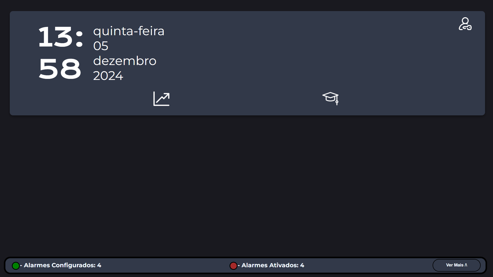

<h1>Portfólio do Meu Progresso em Desenvolvimento de Projetos da Fatec</h1>

<h3>Introdução:</h3>

Neste repositório pretendo apresentar um resumo de projetos semestrais que desenvolvi e que venho desenvolvendo no curso de D.S.M. (<a target="_blank" href="https://www.cps.sp.gov.br/cursos-fatec/desenvolvimento-de-software-multiplataforma/">Desenvolvimento de Software Multiplataforma</a>) na Fatec de São José dos Campos.

Estou atualmente no quarto semestre do curso e, como estou quase no final, já é possível ter uma visão geral do que foi desenvolvido durante esse período e avaliar minha evolução durante os semestres.

 
<h2>Índice</h2>

#### → <a color="white" href="#who-am-I">Sobre mim</a> 

#### → <a color="white" href="#fatec">Minha experiência na Fatec</a> 

#### → <a color="white" href="#projects">Meus projetos:</a>

- <a href="#1Semestre"> 1º Semestre:</a> (🔗<a target="_blank" href="https://github.com/api-fatec-First-Semester/api-First-Semester ">Sistema de análise de dados relacionados à Covid longa</a> a>)
- <a href="#2Semestre"> 2º Semestre:</a> (🔗<a target="_blank" href="https://github.com/BananaaScript/BetterCallUs">Sistema de gerenciamento de chamadas de serviço</a> )
- <a href="#3Semestre"> 3º Semestre:</a> (🔗<a target="_blank" href="https://github.com/BananaaScript/SGA">Sistema de gerenciamento de ativos</a> )
- <a href="#4Semestre"> 4º Semestre:</a> (🔗<a target="_blank" href="https://github.com/BananaScripts/Meteorological-Data-Collector">Sistema de Coleta e Processamento de Dados de Estações Meteorológicas</a>)
 

<h2 id="who-am-I">Quem sou eu?</h2>
 

<h4 align="center"> - <a target="_blank" href="https://www.linkedin.com/in/douglas-ferrini-medeiros-02b735270/">Linkedin</a> - <a target ="_blank" href="https://github.com/DouglasMedeiros1">GitHub</a> - </h4>

 
<b>Meu nome é Douglas, sou um Desenvolvedor de 19 anos que está aprendendo sobre desenvolvimento de sistemas de forma prática.</b> Nestes últimos quatro semestres venho aprendendo muito sobre o mundo da programação, aumentando minha vontade de desenvolver sistemas complexos e, ao mesmo tempo, familiares aos usuários.

 
<h4>Áreas de Interesse</h4>

Tenho grande interesse em diversas áreas da tecnologia, especialmente Desenvolvimento Web, IoT, Arquitetura de Software e Inteligência Artificial

 

<h3 id="fatec">Minha experiência na Fatec</h3>

Desde que entrei na Fatec em 2023, venho aprendendo muito sobre desenvolvimento de sistemas orientados a objetos graças ao método Project Integrated Learning, onde é possível desenvolver sistemas de forma prática, simulando projetos reais utilizando métodos ágeis.</6p>

<b>Desde o início do curso, tenho interesse em ocupar a posição de Product Owner. </b> Pude atuar como Product Owner durante o segundo e terceiro semestres, onde adquiri muito conhecimento sobre a área e gestão de equipes, além de obviamente me ajudar a gerenciar as expectativas do cliente e da equipe de desenvolvimento.

No quarto semestre, foquei em desenvolver minhas habilidades práticas, então não atuei como Product Owner nem como Scrum Master. No entanto, pude participar de novas áreas, desenvolvendo a arquitetura de todo o sistema e configurando a estação meteorológica, o que aprimorou meus conhecimentos nas áreas de Redes e IoT.

 
<h2 id="projects">Meus Projetos</h2>

Como o curso de DSM da Fatec de SJC utiliza o método Project-Based Learning, é comum entregarmos um projeto completo a cada semestre, utilizando metodologia ágil.

Durante o semestre, são 5 etapas até o final do desenvolvimento do projeto, que são: 4 Sprints com duração de 3 semanas cada Kickoff, onde nos é apresentada a proposta e a empresa parceira que será o cliente com quem devemos alinhar expectativas e esclarecer dúvidas sobre os requisitos, além de ser quem define se o que foi entregue no Sprint atende às necessidades da empresa.

 
<h3 id="1Semestre">Sistema de Análise de Dados Relacionados à Covid Longa</h3>
<h5> Equipe: <a href="https://github.com/api-fatec- Primeiro-semestre">ACE</a> - Sistema de Análise de Dados da Covid Longa</h5>
<h4> → 1º Semestre de 2023</h4>
 
<h4>Parceiro Acadêmico:</h4>

  

<a href="https://fatecsjc-prd.azurewebsites.net/">Faculdade de Tecnologia de São José dos Campos - Prof. Jessen Vidal</a>

 

<h5>Escopo do Projeto:</h5>

<b>O objetivo deste projeto é coletar e analisar dados relacionados à Long Covid do sistema Datasus (Tabnet), com o intuito de avaliar o impacto "pós-pandemia" no Sistema Único de Saúde.</b > Com foco nos municípios do Vale do Paraíba - São José dos Campos, Jacareí e Taubaté - a análise desses dados pode gerar resultados relevantes para futuras reportagens jornalísticas, tanto em nível regional, estadual e nacional.

 

<h5>Tecnologias Adotadas:</h5>

 Nomes das Tecnologias (Clique para ver) 

 
  
 Python 

  
 Flask 

  
 Html 5 

  
 CSS 3 

  
 Git/ Github 

 
 
<h5>Visualização final do projeto (Gif)</h5>

  

 

<h5>Minhas Contribuições: </h5>

Durante o período de desenvolvimento do projeto, pude contribuir para o desenvolvimento do design da interface. Por ser um projeto curto e não utilizar sistemas minimamente complexos, o trabalho individual acabou se tornando tarefas simples, contendo pouca ou nenhuma dificuldade.

Durante o último Sprint tive meu melhor desempenho, onde fui responsável por reestruturar a tela do projeto que apresentava a equipe, a proposta do projeto e nossos objetivos.

 

<h5>O que Aprendi Durante o Desenvolvimento:</h5>

- Pude aprender a começar a trabalhar com Flask e Python, podendo aprender sobre a estrutura de um sistema usando Flask.

- Comecei a aprender a estilizar páginas usando Css, que apesar de básico em design, pode me introduzir na área.

- Descobrir e aprender diversas sintaxes HTML utilizadas em grandes projetos, ganhando familiaridade com a linguagem de marcação

 

<h6> HardSkills Aprendidas: </h6>

 Hard Skills (Clique para Ver)
summary>
 
<table align="center">
<tr>
<th width="300px">Tecnologia</th>
<th width="300px">Classificação</th>
<th width="300px">Descrição</th>
</tr>
<tr>
<td>Git / Github</td>
<td>★★☆☆☆☆☆☆☆☆</td>
<td>
Pude ter meu primeiro contato com a plataforma Gtihub. Aprendi a criar meus repositórios e fazer meus primeiros commits.
</td>
</tr>
<tr>
<td>Python</td>
<td>★★☆☆☆☆☆☆☆☆</td>
<td>Meu primeiro contato com programação! Aprendi a fazer funções simples.</td>
</tr>
<tr>
<td>Flask</td>
<td>★★☆☆☆☆☆☆☆☆</td>
<td>Aprendi a fazer upload de um site e o básico sobre redes, IPs, etc.</td>
</tr>
<tr>
<td>Html</td>
<td>★★☆☆☆☆☆☆☆☆</td>
<td>Aprendi um pouco sobre como estruturar um sistema, usar a sintaxe HTML e a base de um arquivo HTML.</td>
</tr>
<tr>
<td>Css</td>
<td>★★☆☆☆☆☆☆☆☆</td>
<td>Comecei a estilizar uma página, centralizei minhas primeiras divs e dei meus primeiros passos nessa tecnologia.</td>
</tr>
</table>

* A classificação acima não se refere à nota obtida durante o semestre, é apenas uma autoavaliação baseada no tempo, conhecimento e familiaridade que tive com a tecnologia.

 

 

<h6> SoftSkills Aprendidas: </h6>

 SoftSkills (Clique para Ver)

 

Aprenda sobre metodologia ágil de forma prática, desde sua estrutura até sua execução.

Me adaptei à vida na faculdade, levando a sério a necessidade de adquirir conhecimento e experiência. 

 Eu vivi com diferentes tipos de pessoas, com uma variedade de gostos, idades e experiências. 

 

<h3 id="2Semestre">Sistema de gerenciamento de chamadas de serviço</h3>
<h5> Equipe: <a href="https://github.com/BananaaScript">BananaScript</a>- BetterCallUs</h5>
<h4 > → 2º semestre de 2023</h4>
 
<h4>Parceiro acadêmico:</h4>

  

<a href="https://fatecsjc-prd.azurewebsites.net/">Faculdade de Tecnologia de São José dos Campos - Prof. Jessen Vidal</a>

 

<h5>Escopo do Projeto:</h5>

<b> Com base no desafio acadêmico proposto pelo cliente interno, o projeto consiste em um sistema de gerenciamento de chamados de serviço, que consiste em um sistema com três frentes: </b> O usuário comum que consulta o call center sobre problemas ou faz uma solicitação de suporte técnico para resolver o possível problema. Suporte que auxilia os usuários resolvendo seus problemas e computa o problema relatado pelo usuário, para que possa ser consultado no futuro. O administrador é responsável por gerenciar e registrar usuários e equipamentos.

 

<h5>Tecnologias adotadas:</h5>

 Nome das Tecnologias (Clique para ver) 

 
  
 Typescript 

  
 Node.js 

  
 React 

  
 HTML 5 

  
 CSS 3 

  
 Mysql 

  
 Figma 

  
 Git/ Github 

 

 <h5>Visualização do protótipo do projeto (PDF)</h5>

 <a href="./public/doc/2Semestre_API_Wireframe.pdf">Wireframe do Sistema</a> 

 

<h5>Minhas Contribuições: </h5>

Durante o processo de desenvolvimento consegui ocupar a posição de desenvolvedor frontend durante os 2 primeiros Sprints e ocupei a posição de Product Owner na segunda metade do desenvolvimento, ainda fazendo tarefas de frontend. No entanto, como todo o sistema foi desenvolvido em Typescript, muitas tarefas envolviam o envolvimento de várias pessoas, o que facilitava o desenvolvimento, mas acabava impedindo o progresso individual. 

Durante meu período como desenvolvedor, enfrentei novos desafios, pois em comparação à API anterior isso seria muito maior. No entanto, consegui fazer o que me foi proposto, entregando minhas atividades com qualidade e sempre me interessando pelo processo de gestão da equipe.

<b>Por isso, quando o grupo começou a apresentar dificuldades na sua gestão, me coloquei à disposição para assumir o cargo de Product Owner e me tornar o antigo Product Owner e Scrum Master.<b/>

De qualquer forma, durante os dois últimos Sprints, conseguimos corrigir os problemas que estávamos trazendo dos últimos Sprints e conseguimos entregar uma entrega satisfatória tanto para o cliente quanto para o grupo

 <h5>O que Aprendi Durante o Desenvolvimento:</h5>

- Tive mais contato com linguagens utilizadas em grandes projetos de sistemas Web

- Ganhei mais familiaridade com sistemas desenvolvidos utilizando Typescript, Node.js e React

⁣- Consegui gerenciar a equipe de desenvolvimento como Product Owner e busquei métodos de documentação e gestão de uma equipe

 

<h6> HardSkills Aprendidas: </h6>

 Hard Skills (Clique para Ver) 

 
<table align="center">
<tr>
<th width="300px">Tecnologia</th>
<th width="300px">Classificação</th>
<th width="300px">Descrição</th>
</tr>
<tr>
<td>Git / Github</td>
<td>★★★☆☆☆☆☆☆☆</td>
<td> Pude ter meu primeiro contato com branches e comecei a usar mais o github e seus comandos.</td>
</tr>
<tr>
<td>Typescript</td>
<td>★★☆☆☆☆☆☆☆☆</td>
<td> Posso começar a ter contato com essa nova tecnologia, começando a aprender a usá-la.</td>
</tr>
<tr>
<td>React</td>
<td>★★☆☆☆☆☆☆☆☆</td>
<td> Tive algum contato com ela porque estava trabalhando como frontend, mas não aprendi muito.</td>
</tr>
<tr>
<td>Node.js</td>
<td>★★☆☆☆☆☆☆☆☆</td>
<td> Consegui aprender a usar essa nova ferramenta, mas não tive muito contato com ele.</td>
</tr>
<tr>
<td>Html</td>
<td>★★★☆☆☆☆☆☆☆</td>
<td> Ganhei mais familiaridade e, portanto, consegui fazer designs mais bonitos e organizados.</td>
</tr>
<tr>
<td>Css</td>
<td>★★★☆☆☆☆☆☆☆</td>
<td> Ganhei mais conhecimento sobre, e consegui começar a "inovar" em designs.</td>
</tr>
<tr>
<td>MySql</td>
<td>★★☆☆☆☆☆☆☆</td>
<td> Eu consegui aplicar um banco de dados à API e, embora não o tenha usado diretamente, consegui começar a aprender mais.</td>
</tr>

</table>

* A classificação acima não se refere à nota obtida durante o semestre, é apenas uma autoavaliação baseada no tempo, conhecimento e familiaridade que tive com a tecnologia.

 

 
<h6> SoftSkills aprendidas: </h6>

 SoftSkills (clique para visualizar) 

 

 Aprendi sobre como gerenciar uma equipe usando a metodologia ágil, desde o gerenciamento de expectativas até a definição de entregas e prazos. 

 Aprendi como obter uma comunicação eficaz com o cliente, sabendo assim o que perguntar e como perguntar. 

 Aprendi como assumir a liderança em um projeto, demonstrando interesse e ajudando meus colegas a concluir suas tarefas. 

 

<h3 id="3Semestre">Sistema de Gestão de Ativos</h3>
<h5> Equipe: <a href="https://github.com/BananaaScript">BananaScript </a> - SGA (Sistema de Gestão de Ativos)</h5>
<h4 > → 1º Semestre de 2024</h4>
 
<h4>Parceiro Acadêmico:</h4>

  

<a href="https://youtan.com.br/">Youtan: Conectando Oportunidades e Soluções</a>

 

<h5>Escopo do Projeto:</h5>

Este projeto tem como objetivo desenvolver um sistema de gestão de ativos (SGA), fornecendo a uma empresa uma plataforma de gestão de ativos eficaz, com funcionalidades intuitivas, o SGA simplifica o processo de gestão de ativos, garantindo uma administração eficiente.

 

<h5>Tecnologias Adotadas:</h5>

 Nomes das Tecnologias (Clique para Ver) 

 
  
 Typescript 

  
 Node.js 

  
 React 

  
 Java 

  
 Spring 

  
 HTML 5 

  
 CSS 3 

  
 Mysql 

  
 Figma 

  
 Git/ Github 

 
 
<h5>Visualização do escopo do projeto (PowerPoint)</h5>

 <a href="./public/doc/3Semestre_API_Scopo.pptmf">Escopo do sistema</a> 

 

<h5>Minhas contribuições: </h5>

Neste projeto desenvolvi sistemas no frontend usando Typescript e mais uma vez consegui ocupar a posição de Product Owner por 3 Sprints, pois no quarto Sprint o grupo teve problemas de performance e precisou mudar funções.

 Com novos membros no grupo, a dificuldade de gerenciamento foi maior, porém, não só participando, mas também definindo as prioridades e funcionalidades do sistema durante o kickoff do projeto, conseguimos ter uma melhor definição do que e como deveria ser feito.

<b>Como desenvolvedor Frontend, consegui melhorar muito meus conhecimentos em Typescript e React em um sistema orientado a objetos. Além disso, por ter um backend mais isolado, por ser desenvolvido em Java, foi possível aprimorar ainda mais minhas habilidades individuais, entregando interfaces que receberam aprovação e satisfação do cliente.<b/>

 <h5>O que aprendi durante o desenvolvimento:</h5>

- Como documentar o processo de desenvolvimento do projeto de forma mais clara e transparente

- Novas habilidades em definir prazos, entregas, prioridades e gerenciar as expectativas do cliente e da equipe de desenvolvimento

- Aprimorando minhas habilidades em desenvolver sistemas orientados a objetos

 

<h6> HardSkills aprendidas: </h6>

 Hard Skills (clique para visualizar) 

 
<table align="center">
<tr>
<th width="300px">Tecnologia</th>
<th width="300px">Classificação</th>
<th width="300px">Descrição</th>
</tr>
<tr>
<td>Git / Github</td>
<td>★★★★☆☆☆☆☆☆</td>
<td> Aprendi a usar Submódulos e aprendi novos comandos do git que eu usava com frequência.</td>
</tr>
<tr>
<td>Typescript</td>
<td>★★★☆☆☆☆☆☆☆</td>
<td> Consegui melhorar muito minha familiaridade com a tecnologia usando-a constantemente.</td>
</tr>
<tr>
<td>React</td>
<td>★★★☆☆☆☆☆☆☆</td>
<td> Usei-o muito durante o semestre e aprendi muito com ele, novas funções e melhorei minha lógica nas funções.</td>
</tr>
<tr>
<td>Node.js</td>
<td>★★☆☆☆☆☆☆☆☆</td>
<td>Ainda não tive muito contato, mas aprendi com o grupo o que o código faria.</td>
</tr>
<td>Java</td>
<td>★★☆☆☆☆☆☆☆☆</td>
<td>Consegui começar a usar essa nova linguagem, mas não me acostumei e acabei usando muito pouco.</td>
</tr>
<tr>
<td>Spring</td>
<td>★★☆☆☆☆☆☆☆☆</td>
<td> Não tive muito contato com o projeto, então só aprendi o básico.</td>
</tr>
<tr>
<td>Html</td>
<td>★★★★★☆☆☆☆☆</td>
<td> Pude contribuir muito com os visuais para a equipe e sinto que cheguei a um nível aceitável.</td>
</tr>
<tr>
<td>Css</td>
<td>★★★★☆☆☆☆☆</td>
<td> Comecei a ousar mais e aplicar ideias que antes não conseguia, tornando tudo mais bonito e harmonioso.</td>
</tr>
<tr>
<td>MySql</td>
<td>★★★☆☆☆☆☆☆☆</td>
<td> Apesar de usar mais, por não precisar muito, acabei não usando diretamente, usei as rotas que o backend produzia.</td>
</tr>
<tr>
</table>

* A classificação acima não se refere à nota obtida durante o semestre, é apenas uma autoavaliação baseada no tempo, conhecimento e familiaridade que tive com a tecnologia.

 

 
<h6> SoftSkills Aprendidas: </h6>

 SoftSkills (Clique para Ver) 

 

 Melhorei minha comunicação com meus colegas de equipe e com o cliente, pois neste semestre pudemos ter experiência com uma empresa parceira externa. 

 Consegui definir metas e acordar funcionalidades com o cliente, pois fui o principal participante do Kickoff, experiência que ainda não havia tido. 

 Aprendi a ser versátil e a conseguir instruir adequadamente o novo Product Owner no meio do processo de 3 Sprints. 

 

<h3 id="4Semestre">Sistema de Coleta e Processamento de Dados de Estações Meteorológicas</h3>
<h5> Equipe: <a href="https://github.com/BananaaScript">BananaScript </a> - Seth</h5>
<h4 > → 4º Semestre de 2024</h4>
 
<h4>Parceiro Acadêmico:</h4>

  

<a href="https://tecsus.com.br/">Tecsus: Tecnologias para Gestão de Utilidades</a>

 

<h5>Escopo do Projeto:</h5>

Neste Projeto, recebemos o desafio de propor uma solução web que coletasse informações de sensores presentes em estações meteorológicas e apresentasse esses dados de forma intuitiva e prática ao usuário final. Além disso, também tivemos que lidar com outras necessidades do cliente, como configurar alarmes, gerar relatórios e ter uma interface de aprendizagem.

 

<h5>Tecnologias adotadas:</h5>

 Nomes das Tecnologias (Clique para Ver) 

 
  
 Typescript 

  
 Node.js 

  
 React 

  
 HTML 5 

  
 CSS 3 

  
 Prisma 

  
 MongoDB 

  
 PostgreSQL 

  
 Google Cloud 

  
 Docker 

  
 Supabase 

  
 Arduino 

  
 Git/ Github 

 
 
<h5>Visualização do escopo do projeto (vídeo)</h5>

 

<h5>Minhas contribuições: </h5>

Neste projeto, pude contribuir com os quatro MVPs como o principal responsável. Pude participar de tudo, desde a configuração da estação meteorológica e sensores até a exibição desses dados, processamento dos dados e enriquecimento da correlação desses dados.

<b> Portanto, pude melhorar minhas habilidades não apenas em Frontend, mas principalmente pude melhorar minhas habilidades em Bakcend, participando da criação de controles de dados, do coletor de dados e do processamento desses dados.</b>

 Além disso, com a implementação dos padrões Devops, pudemos aprender muito sobre documentação de um sistema como o nosso. Lidei especificamente com esses padrões aplicados ao banco de dados, versionamento e aplicação de cargas de dados naquele banco de dados. Também implementamos a implantação neste banco usando Supabase e Prisma (ORM) no desenvolvimento do sistema.

 <h5>O que aprendi durante o desenvolvimento:</h5>

- Como aplicar padrões Devops em um sistema em desenvolvimento

- Lidar com sistemas e dispositivos conectados via HTTP, aplicando conceitos de rede e IOT.

- Melhorei minhas habilidades no desenvolvimento de recursos de backend e na organização do código Frontend.

 

<h6> HardSkills aprendidos: </h6>

 Hard Skills (clique para visualizar) 

 
<table align="center">
<tr>
<th width="300px">Tecnologia</th>
<th width="300px">Classificação</th>
<th width="300px">Descrição</th>
</tr>
<tr>
<td>Git / Github</td>
<td>★★★★★☆☆☆☆☆</td>
<td> Usei novas ferramentas de plataforma constantemente, como tags, o wiki e organizamos nossos branches e submódulos de uma forma mais funcional.</td>
</tr>
<tr>
<td>Typescript</td>
<td>★★★★★☆☆☆☆☆</td>
<td> Como é usada em todo o sistema, usei a linguagem quase diariamente e melhorei muito meu conhecimento sobre ela.</td>
</tr>
<tr>
<td>React</td>
<td>★★★★☆☆☆☆☆</td>
<td> Não participei muito do frontend, mas ainda consegui melhorar a organização e hierarquia do meu código.</td>
</tr>
<tr>
<td>Node.js</td>
<td>★★★★☆☆☆☆☆☆</td>
<td> Usei muito mais neste semestre e consegui aprender mais e me familiarizar mais com sua sintaxe.</td>
</tr>
<tr>
<td>Html</td>
<td>★★★★☆☆☆☆☆</td>
<td> Não inovei muito, mas consegui deixar o código mais limpo e legível.</td>
</tr>
<tr>
<td>Css</td>
<td>★★★★★☆☆☆☆☆</td>
<td> Não aprendi nada de novo, mas aproveitei melhor o que já sabia.</td>
</tr>
<tr>
<td>Prisma</td>
<td>★★★☆☆☆☆☆☆☆</td>
<td> Não tinha tido contato com ele antes, mas usando bastante, aprendi muito sobre como usá-lo.</td>
</tr>
<tr>
<td>Supabase</td>
<td>★★☆☆☆☆☆☆☆☆</td>
<td> Usei apenas o principal, acredito que com mais tempo, poderia usar novos recursos que tornaria o processo mais fácil.</td>
</tr>
<tr>
<td>Postgres</td>
<td>★★★☆☆☆☆☆☆☆</td>
<td> Usei no desenvolvimento e conexão do Prisma com o Supabase, mas não precisei me aprofundar na sintaxe ou estrutura.</td>
</tr>
<tr>
<td>MongoDB</td>
<td>★★★☆☆☆☆☆☆</td>
<td> Eu já tinha tido contato no semestre passado, então apenas reutilizei o conhecimento que já tinha, aprimorando-o.</td>
</tr>
<tr>
<td>Arduino</td>
        <td>★★★☆☆☆☆☆☆☆</td>
<td> Como fui o único a utilizar e configurar a estação, conheci essa nova tecnologia de forma prática, mas não me aprofundei.</td>
</tr>
<tr>
<td>Docker</td>
<td>★★☆☆☆☆☆☆☆☆</td>
<td>Já tinha tido contato no primeiro semestre, mas como não utilizei diretamente, só entendi a base do código e como ele funciona.</td>
</tr>
<tr>
<td>Google Cloud Platform</td>
<td>★☆☆☆☆☆☆☆☆</td>
<td> Vi meus colegas usarem várias vezes, e entendi a interface, mas nunca cheguei a usar.</td>
</tr>
<tr>
</table>

* A classificação acima não se refere à nota obtida durante o semestre, é apenas uma autoavaliação baseada no tempo, conhecimento e familiaridade que tive com a tecnologia.

 

 
<h6> SoftSkills Aprendidas: </h6>

 SoftSkills (Clique para Ver) 

 

 Consegui me organizar com o grupo para definir padrões de Devops. 

 Consegui manter uma comunicação clara com o grupo e seguimos os padrões definidos por cada membro. 

 Consegui aprender a documentar meus processos e os padrões que precisam ser seguidos. 

 Consegui desenvolver e apresentar nossa arquitetura ao cliente e à equipe de forma objetiva e clara.

 
 
 
 

